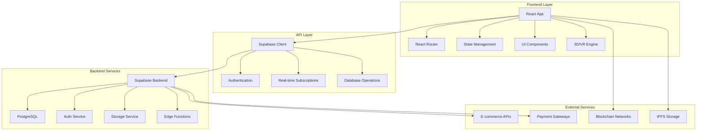
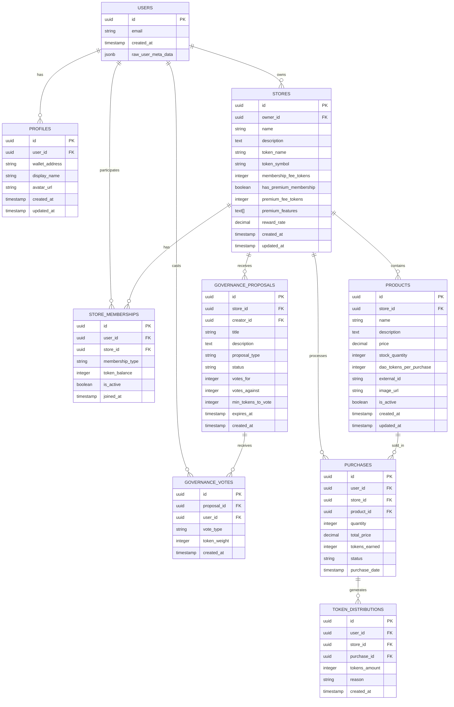
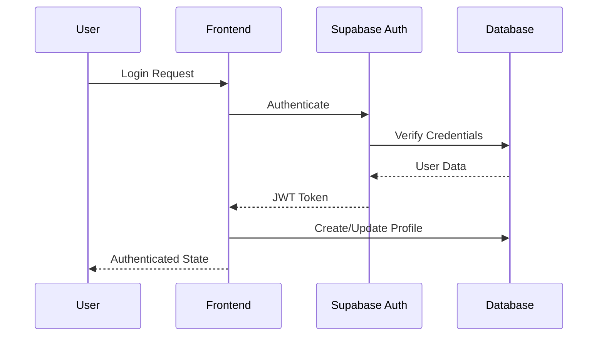
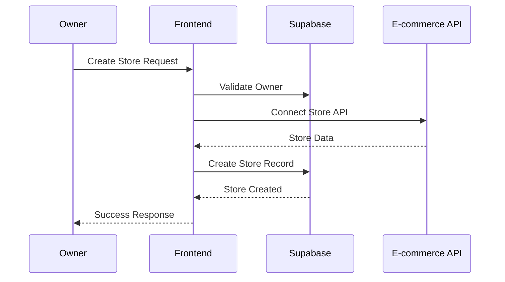
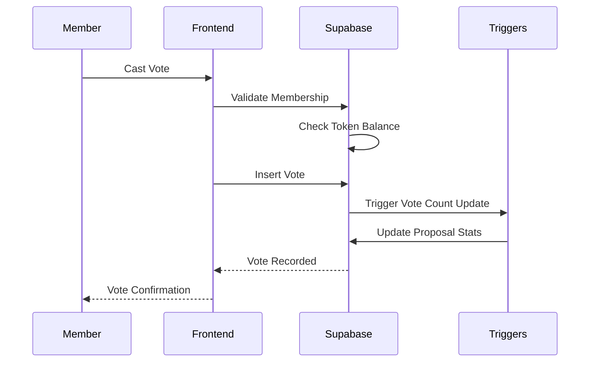
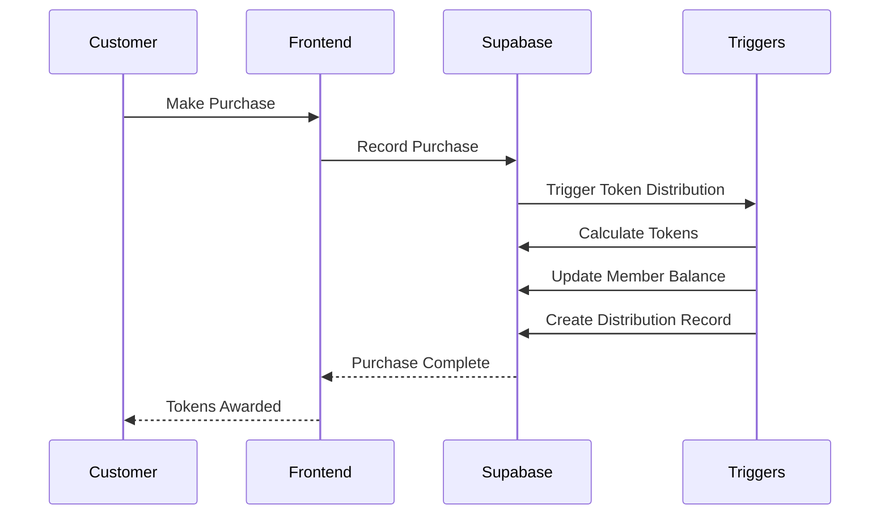

# CommerceDAO Platform Mimarisi

Bu dokümantasyon, CommerceDAO platformunun teknik mimarisini, veri akışını ve sistem bileşenlerini detaylı olarak açıklar.

## 🏗️ Sistem Mimarisi Genel Bakış



## 🎯 Katmanlı Mimari

### 1. Presentation Layer (Frontend)
- **React 18** - Modern UI framework
- **TypeScript** - Type safety
- **Tailwind CSS** - Utility-first styling
- **React Three Fiber** - 3D graphics
- **React Query** - Server state management

### 2. Business Logic Layer
- **Custom Hooks** - Reusable business logic
- **Context Providers** - Global state management
- **Service Classes** - API interactions
- **Utility Functions** - Helper functions

### 3. Data Access Layer
- **Supabase Client** - Database operations
- **Real-time Subscriptions** - Live data updates
- **Local Storage** - Client-side caching
- **IndexedDB** - Offline data storage

### 4. Infrastructure Layer
- **Supabase Backend** - BaaS platform
- **PostgreSQL** - Primary database
- **Edge Functions** - Serverless compute
- **CDN** - Static asset delivery

## 📊 Veri Modeli

### Core Entities



### Veri İlişkileri

#### 1. User Management
- **Users** ↔ **Profiles**: One-to-One
- **Users** ↔ **Store Memberships**: One-to-Many
- **Users** ↔ **Stores** (as owner): One-to-Many

#### 2. Store Ecosystem
- **Stores** ↔ **Products**: One-to-Many
- **Stores** ↔ **Memberships**: One-to-Many
- **Stores** ↔ **Proposals**: One-to-Many

#### 3. Governance System
- **Proposals** ↔ **Votes**: One-to-Many
- **Users** ↔ **Votes**: One-to-Many
- **Memberships** → **Voting Power**: Calculated

#### 4. Commerce Flow
- **Products** ↔ **Purchases**: One-to-Many
- **Purchases** ↔ **Token Distributions**: One-to-Many

## 🔄 Veri Akışı

### 1. User Authentication Flow



### 2. Store Creation Flow



### 3. Governance Voting Flow



### 4. Token Distribution Flow



## 🔧 Teknik Bileşenler

### Frontend Architecture

```typescript
// Component Hierarchy
src/
├── components/
│   ├── ui/                 // Base UI components
│   ├── layout/            // Layout components
│   ├── features/          // Feature-specific components
│   └── shared/            // Shared components
├── pages/                 // Route components
├── hooks/                 // Custom React hooks
├── services/              // API services
├── utils/                 // Utility functions
├── types/                 // TypeScript definitions
└── stores/                // State management
```

### State Management Strategy

```typescript
// Global State (React Context)
interface AppState {
  user: User | null;
  theme: 'light' | 'dark';
  wallet: WalletState;
}

// Server State (React Query)
const useStores = () => {
  return useQuery({
    queryKey: ['stores'],
    queryFn: fetchStores,
    staleTime: 5 * 60 * 1000, // 5 minutes
  });
};

// Local State (useState/useReducer)
const [filters, setFilters] = useState<StoreFilters>({
  category: 'all',
  sortBy: 'holders',
});
```

### API Layer Design

```typescript
// Service Layer
class StoreService {
  async getStores(filters?: StoreFilters): Promise<Store[]> {
    const query = supabase
      .from('stores')
      .select('*');
    
    if (filters?.category && filters.category !== 'all') {
      query.eq('category', filters.category);
    }
    
    const { data, error } = await query;
    if (error) throw error;
    return data;
  }
  
  async createStore(store: CreateStoreRequest): Promise<Store> {
    const { data, error } = await supabase
      .from('stores')
      .insert(store)
      .select()
      .single();
    
    if (error) throw error;
    return data;
  }
}

// Hook Layer
export const useStores = (filters?: StoreFilters) => {
  return useQuery({
    queryKey: ['stores', filters],
    queryFn: () => storeService.getStores(filters),
    enabled: true,
  });
};
```

## 🔐 Güvenlik Mimarisi

### Row Level Security (RLS) Policies

```sql
-- Profiles: Users can only see their own profile
CREATE POLICY "Users can view own profile" ON profiles
  FOR SELECT USING (auth.uid() = user_id);

-- Stores: Public read, owner write
CREATE POLICY "Stores are publicly readable" ON stores
  FOR SELECT USING (true);

CREATE POLICY "Store owners can update" ON stores
  FOR UPDATE USING (auth.uid() = owner_id);

-- Memberships: Members can see their own, owners can see all
CREATE POLICY "Members can view own membership" ON store_memberships
  FOR SELECT USING (auth.uid() = user_id);

CREATE POLICY "Store owners can view all memberships" ON store_memberships
  FOR SELECT USING (
    EXISTS (
      SELECT 1 FROM stores 
      WHERE id = store_id AND owner_id = auth.uid()
    )
  );

-- Governance: Members only
CREATE POLICY "Store members can view proposals" ON governance_proposals
  FOR SELECT USING (
    EXISTS (
      SELECT 1 FROM store_memberships 
      WHERE store_id = governance_proposals.store_id 
      AND user_id = auth.uid() 
      AND is_active = true
    )
  );
```

### Authentication Flow

```typescript
// Auth Context
interface AuthContextType {
  user: User | null;
  profile: Profile | null;
  signIn: (email: string, password: string) => Promise<AuthResult>;
  signUp: (email: string, password: string) => Promise<AuthResult>;
  signOut: () => Promise<void>;
  connectWallet: (address: string) => Promise<void>;
}

// Protected Route Component
const ProtectedRoute: React.FC<{ children: React.ReactNode }> = ({ children }) => {
  const { user, loading } = useAuth();
  
  if (loading) return <LoadingSpinner />;
  if (!user) return <Navigate to="/auth" />;
  
  return <>{children}</>;
};
```

## 🚀 Performance Optimizations

### Code Splitting Strategy

```typescript
// Route-based splitting
const Home = lazy(() => import('./pages/Home'));
const Stores = lazy(() => import('./pages/Stores'));
const StoreDetail = lazy(() => import('./pages/StoreDetail'));

// Component-based splitting
const MetaverseScene = lazy(() => import('./components/MetaverseScene'));
const GovernancePanel = lazy(() => import('./components/GovernancePanel'));

// Feature-based splitting
const routes = [
  {
    path: '/',
    component: Home,
    preload: () => import('./pages/Home'),
  },
  {
    path: '/stores',
    component: Stores,
    preload: () => import('./pages/Stores'),
  },
];
```

### Caching Strategy

```typescript
// React Query Configuration
const queryClient = new QueryClient({
  defaultOptions: {
    queries: {
      staleTime: 5 * 60 * 1000, // 5 minutes
      cacheTime: 10 * 60 * 1000, // 10 minutes
      retry: 3,
      refetchOnWindowFocus: false,
    },
  },
});

// Service Worker Caching
self.addEventListener('fetch', (event) => {
  if (event.request.url.includes('/api/')) {
    event.respondWith(
      caches.open('api-cache').then((cache) => {
        return cache.match(event.request).then((response) => {
          if (response) {
            // Serve from cache
            fetch(event.request).then((fetchResponse) => {
              cache.put(event.request, fetchResponse.clone());
            });
            return response;
          }
          // Fetch and cache
          return fetch(event.request).then((fetchResponse) => {
            cache.put(event.request, fetchResponse.clone());
            return fetchResponse;
          });
        });
      })
    );
  }
});
```

### Bundle Optimization

```typescript
// Vite Configuration
export default defineConfig({
  build: {
    rollupOptions: {
      output: {
        manualChunks: {
          // Vendor chunks
          react: ['react', 'react-dom'],
          router: ['react-router-dom'],
          ui: ['@radix-ui/react-dialog', '@radix-ui/react-dropdown-menu'],
          
          // Feature chunks
          three: ['three', '@react-three/fiber', '@react-three/drei'],
          charts: ['recharts'],
          forms: ['react-hook-form', '@hookform/resolvers'],
          
          // Utility chunks
          utils: ['date-fns', 'clsx', 'tailwind-merge'],
        },
      },
    },
    chunkSizeWarningLimit: 1000,
  },
  optimizeDeps: {
    include: ['react', 'react-dom', 'react-router-dom'],
  },
});
```

## 📱 Responsive Design Architecture

### Breakpoint System

```typescript
// Tailwind Configuration
const screens = {
  'xs': '475px',
  'sm': '640px',
  'md': '768px',
  'lg': '1024px',
  'xl': '1280px',
  '2xl': '1536px',
};

// Responsive Hook
const useBreakpoint = () => {
  const [breakpoint, setBreakpoint] = useState<string>('sm');
  
  useEffect(() => {
    const updateBreakpoint = () => {
      const width = window.innerWidth;
      if (width >= 1536) setBreakpoint('2xl');
      else if (width >= 1280) setBreakpoint('xl');
      else if (width >= 1024) setBreakpoint('lg');
      else if (width >= 768) setBreakpoint('md');
      else if (width >= 640) setBreakpoint('sm');
      else setBreakpoint('xs');
    };
    
    updateBreakpoint();
    window.addEventListener('resize', updateBreakpoint);
    return () => window.removeEventListener('resize', updateBreakpoint);
  }, []);
  
  return breakpoint;
};
```

### Mobile-First Components

```typescript
// Responsive Navigation
const Navigation: React.FC = () => {
  const [isMobileMenuOpen, setIsMobileMenuOpen] = useState(false);
  const breakpoint = useBreakpoint();
  
  return (
    <nav className="fixed top-0 left-0 right-0 z-50 glass-effect">
      <div className="container mx-auto px-4">
        <div className="flex items-center justify-between h-16">
          {/* Logo */}
          <Logo />
          
          {/* Desktop Menu */}
          <div className="hidden md:flex items-center space-x-8">
            <NavLinks />
          </div>
          
          {/* Mobile Menu Button */}
          <button
            className="md:hidden"
            onClick={() => setIsMobileMenuOpen(!isMobileMenuOpen)}
          >
            <MenuIcon />
          </button>
        </div>
        
        {/* Mobile Menu */}
        {isMobileMenuOpen && (
          <div className="md:hidden">
            <MobileNavLinks />
          </div>
        )}
      </div>
    </nav>
  );
};
```

## 🔄 Real-time Architecture

### Supabase Subscriptions

```typescript
// Real-time Store Updates
const useStoreSubscription = (storeId: string) => {
  const queryClient = useQueryClient();
  
  useEffect(() => {
    const subscription = supabase
      .channel(`store-${storeId}`)
      .on(
        'postgres_changes',
        {
          event: '*',
          schema: 'public',
          table: 'stores',
          filter: `id=eq.${storeId}`,
        },
        (payload) => {
          queryClient.invalidateQueries(['store', storeId]);
        }
      )
      .on(
        'postgres_changes',
        {
          event: '*',
          schema: 'public',
          table: 'governance_proposals',
          filter: `store_id=eq.${storeId}`,
        },
        (payload) => {
          queryClient.invalidateQueries(['proposals', storeId]);
        }
      )
      .subscribe();
    
    return () => {
      subscription.unsubscribe();
    };
  }, [storeId, queryClient]);
};

// Real-time Voting Updates
const useVotingSubscription = (proposalId: string) => {
  const [voteCount, setVoteCount] = useState({ for: 0, against: 0 });
  
  useEffect(() => {
    const subscription = supabase
      .channel(`proposal-${proposalId}`)
      .on(
        'postgres_changes',
        {
          event: '*',
          schema: 'public',
          table: 'governance_votes',
          filter: `proposal_id=eq.${proposalId}`,
        },
        async () => {
          // Fetch updated vote counts
          const { data } = await supabase
            .from('governance_proposals')
            .select('votes_for, votes_against')
            .eq('id', proposalId)
            .single();
          
          if (data) {
            setVoteCount({
              for: data.votes_for,
              against: data.votes_against,
            });
          }
        }
      )
      .subscribe();
    
    return () => subscription.unsubscribe();
  }, [proposalId]);
  
  return voteCount;
};
```

## 🧪 Testing Architecture

### Testing Strategy

```typescript
// Unit Tests
describe('StoreCard Component', () => {
  it('renders store information correctly', () => {
    const mockStore = createMockStore();
    render(<StoreCard store={mockStore} />);
    
    expect(screen.getByText(mockStore.name)).toBeInTheDocument();
    expect(screen.getByText(mockStore.tokenSymbol)).toBeInTheDocument();
  });
  
  it('handles click events', () => {
    const mockStore = createMockStore();
    const onClickMock = jest.fn();
    
    render(<StoreCard store={mockStore} onClick={onClickMock} />);
    fireEvent.click(screen.getByRole('button'));
    
    expect(onClickMock).toHaveBeenCalledWith(mockStore.id);
  });
});

// Integration Tests
describe('Store Management Flow', () => {
  it('allows store owner to create and manage store', async () => {
    // Setup authenticated user
    const user = await createTestUser();
    
    // Navigate to store creation
    render(<App />, { wrapper: AuthProvider });
    await navigateToStoreCreation();
    
    // Fill store form
    await fillStoreForm({
      name: 'Test Store',
      tokenSymbol: 'TEST',
    });
    
    // Submit and verify
    await submitForm();
    expect(await screen.findByText('Store created successfully')).toBeInTheDocument();
  });
});

// E2E Tests
describe('Complete User Journey', () => {
  it('user can discover, join, and participate in store governance', async () => {
    await page.goto('/stores');
    
    // Discover stores
    await page.waitForSelector('[data-testid="store-card"]');
    await page.click('[data-testid="store-card"]:first-child');
    
    // Join store
    await page.click('[data-testid="join-store-button"]');
    await page.fill('[data-testid="email-input"]', 'test@example.com');
    await page.fill('[data-testid="password-input"]', 'password123');
    await page.click('[data-testid="signup-button"]');
    
    // Participate in governance
    await page.click('[data-testid="governance-tab"]');
    await page.click('[data-testid="vote-for-button"]:first-child');
    
    // Verify vote recorded
    await expect(page.locator('[data-testid="vote-success"]')).toBeVisible();
  });
});
```

## 📊 Monitoring ve Analytics

### Performance Monitoring

```typescript
// Performance Metrics
const performanceObserver = new PerformanceObserver((list) => {
  list.getEntries().forEach((entry) => {
    if (entry.entryType === 'navigation') {
      const navigationEntry = entry as PerformanceNavigationTiming;
      
      // Track Core Web Vitals
      const metrics = {
        FCP: navigationEntry.responseStart - navigationEntry.fetchStart,
        LCP: navigationEntry.loadEventEnd - navigationEntry.fetchStart,
        FID: 0, // Measured separately
        CLS: 0, // Measured separately
      };
      
      // Send to analytics
      analytics.track('page_performance', metrics);
    }
  });
});

performanceObserver.observe({ entryTypes: ['navigation', 'paint'] });

// Error Tracking
window.addEventListener('error', (event) => {
  analytics.track('javascript_error', {
    message: event.message,
    filename: event.filename,
    lineno: event.lineno,
    colno: event.colno,
    stack: event.error?.stack,
  });
});

// User Behavior Analytics
const trackUserAction = (action: string, properties?: Record<string, any>) => {
  analytics.track(action, {
    ...properties,
    timestamp: Date.now(),
    url: window.location.href,
    userAgent: navigator.userAgent,
  });
};
```

Bu mimari dokümantasyonu, CommerceDAO platformunun teknik altyapısını ve tasarım kararlarını kapsamlı olarak açıklar. Platform geliştirme ve bakım süreçlerinde referans olarak kullanılabilir.